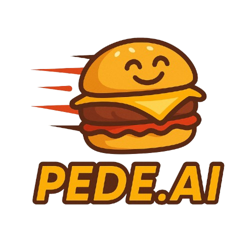

# 🍔 Pede.Aí - Frontend

[](https://vuejs.org/)
[](https://www.typescriptlang.org/)
[](LICENSE)

<div align="center">
  
</div>

## 📌 Visão Geral

Aplicação frontend para rede de fastfood desenvolvida com Vue.js 3 e TypeScript. Oferece interface moderna para clientes fazerem pedidos e painel administrativo para gerenciamento.

## ✨ Funcionalidades

### 🧑‍💻 Cliente
- [x] Catálogo de produtos organizado por categorias
- [x] Carrinho de compras interativo
- [x] Fluxo de pedido intuitivo
- [x] Histórico de pedidos

### 🛠️ Administrativo
- [x] Autenticação de administradores
- [x] CRUD de produtos
- [x] Dashboard de pedidos
- [x] Relatórios de vendas

## 🚀 Começando

### Pré-requisitos
- Node.js 16+
- npm 8+ ou yarn 1.22+
- API backend configurada (veja [backend repository](https://github.com/rhazevedodev/techchallenge-fiap-pedeai))

### Instalação
```bash
# Clone o repositório
git clone https://github.com/fparuce/techchallenge-fiap-pedeai-frontend-vue.git

# Instale as dependências
npm install
```
### Executando a Aplicação
```bash
# Servidor de desenvolvimento
npm run dev

# Build para produção
npm run build

# Servidor de preview da build
npm run preview
```

### 🛠️ Tecnologias Utilizadas
Frontend
- Vue.js 3 - Framework principal
- TypeScript - Tipagem estática
- Vue Router - Navegação SPA
- Axios - Comunicação com API

Ferramentas
- Vite - Build tool
- ESLint + Prettier - Padronização de código
- Vitest - Testes unitários

### 📂 Estrutura do Projeto
fastfood-frontend/
├── src/
│   ├── assets/           # Arquivos estáticos
│   ├── components/       # Componentes reutilizáveis
│   ├── composables/      # Composables do Vue
│   ├── router/           # Configuração de rotas
│   ├── styles/           # Estilos globais
│   ├── types/            # Tipos TypeScript
│   ├── views/            # Páginas/views
│   ├── App.vue           # Componente raiz
│   └── main.ts           # Ponto de entrada
├── public/               # Arquivos públicos
├── tests/                # Testes
├── .env.example          # Modelo de variáveis de ambiente
└── vite.config.ts        # Configuração do Vite

### 🤝 Como Contribuir
- Faça um fork do projeto
- Crie uma branch (git checkout -b feature/AmazingFeature)
- Commit suas alterações (git commit -m 'Add some AmazingFeature')
- Push para a branch (git push origin feature/AmazingFeature)
- Abra um Pull Request

### 📄 Licença
Distribuído sob a licença MIT. Veja [LICENSE](LICENSE) para mais informações.
